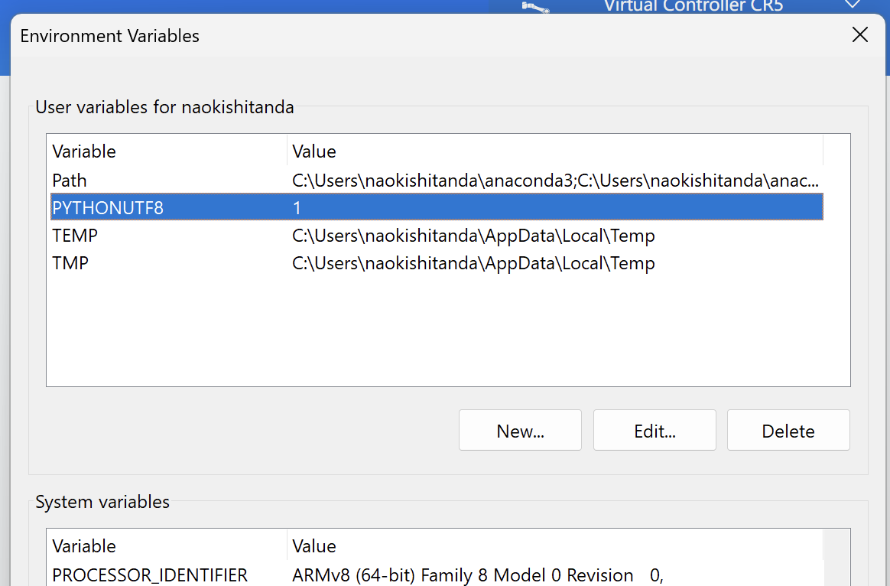

# How to use CRI on macbook Pro M1 with Pararell Desktop
CRI is an common interface to control various robot arms published by Nathan Lepora in University of Bristol. In this repository, I explain how to control Dobot MG400 with CRI on macbook, while Dobot Studio Pro is availbale only on Windows.

# Environment
- M1 MacBook Pro 2020 (macOS Monterey 12.3.1)
- CRI (https://github.com/nlepora/cri)
- Pararells Desktop (Windows11)

#  Steps
## 1. Virtuel Machine Settings
### 1.1 Install Pararells Desktop
Student Discount is available, around £60 per year. https://www.parallels.com/uk/
### 1.2 Build Windows on VM


---
## 2. Windows Setup
### 2.1 Install Python
https://www.python.org/downloads/
### 2.2 Install VScode & Anaconda & Python Extension for Vscode.
https://code.visualstudio.com/download
https://docs.anaconda.com/anaconda/install/windows/


### 2.3 Create Conda Environment
Python vesion == 3.7
### 2.4 Install Dobot Studio Pro
https://www.dobot-robots.com/service/download-center


### 2.5 Connect EathaNet Cable
Connect your laptop and MG400 via EathaNet Cable.

### 2.6 Set Fixed IPv4 Adress on Mac
Go to Network settings on your macbook. Set your EathaNet network IPv4 adress on "192.168.1.40". (Sorry, I'm using macbook with Japanese.) Subnet mask should be "255.255.255.0".


### 2.7 Launch Dobot Studio Pro and Connect to MG400
You will find your MG400 with IP adress "192.168.1.6".

### 2.8 Check Connection
After you push "Enable" bottun, you can control your robot with interface on the bottom right.
---

## 3. Install CRI
### 3.1 Clone CRI Repository
```
$ git clone https://github.com/nlepora/cri
```
### 3.2 Set System Variable "PYTHONUTF8=1"
Set environment variable "PYTHONUTF8" to "1" on Windows Settings. The default language to read setup file is "cp932" in Windows, and it will cause encode error. This environment variable sets it UTF8.


### 3.3 Install C++ Build Tool with Desktop Environment
We need C++ Build Tool to install Pybullet. Install it with "desktop envirionment". Don't forget to check desktop environment on installing process.
https://visualstudio.microsoft.com/visual-cpp-build-tools/

### 3.4 Install CRI
python setup.py install
pip install -e .
pip install pybullet
pip install opencv-python
pip install numpy
pip install pyqt5

### Install TactileGym

## Run Test
